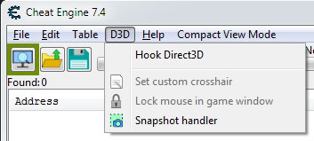
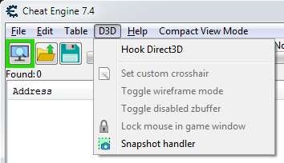
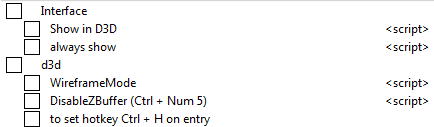

# d3d+.CT

## Description

Cheat Engine Table made to easily disable Z-Buffer and enable Wireframe Mode.

## Limitations

For DirectX (D3D) apps only!

## Features

- Show 2 more options in D3D menu:  
_ Toggle wireframe mode.   
_ Toggle disabled zbuffer.   

- *modes:  
_ show only this time  
_ always (recommended)  
(adds to CE autorun folder)*  

- Separate buttons.   
_ for single click access.  
_ to set hotkey for them.    

## Demonstation

Before:  
  
After:  
  
Table view:  
  

## More info

Earlier CE versions had these 2 buttons visible and the hotkeys for them in the settings. 